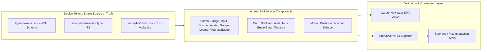
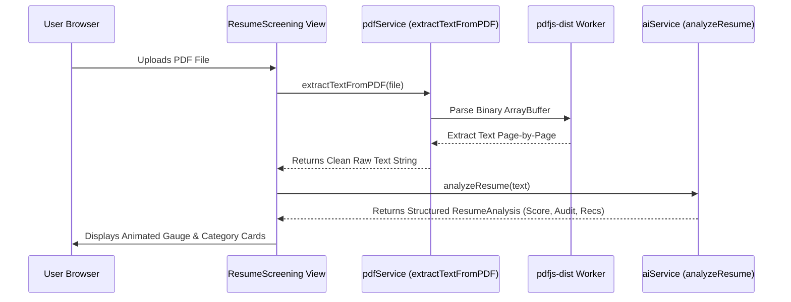

# 🏛️ System Architecture — AI Career Navigator

This document outlines the architectural blueprint, data flow models, design system implementation, and domain structure for **AI Career Navigator**.

---

## 📑 Table of Contents

1. [High-Level Architectural Overview](#1-high-level-architectural-overview)
2. [Folder & Module Structure](#2-folder--module-structure)
3. [Design System & Figma Architecture](#3-design-system--figma-architecture)
4. [Component & Layer Separation](#4-component--layer-separation)
5. [Core Service Interfaces & Heuristic Engine](#5-core-service-interfaces--heuristic-engine)
6. [Client-Side PDF Processing Pipeline](#6-client-side-pdf-processing-pipeline)
7. [Data Models & Supabase Integration](#7-data-models--supabase-integration)
8. [Responsive Navigation & Layout Architecture](#8-responsive-navigation--layout-architecture)
9. [Storybook Component Workshop & Testing](#9-storybook-component-workshop--testing)
10. [Build & Performance Optimization](#10-build--performance-optimization)

---

## 🌐 1. High-Level Architectural Overview

AI Career Navigator is architected as a modular, client-first Single Page Application (SPA) backed by Supabase PostgreSQL for persistence and storage.

```mermaid
flowchart TD
    subgraph Client_App [Client Application Layer (Vite + React 18 + TS)]
        UI[Design System UI & Views]
        Router[React Router SPA]
        Context[UserContext State]
        PDF[Client-Side PDF Engine]
        AI[AI Service & Heuristics]
    end

    subgraph Design_System [Centralized Design System]
        Tokens[src/styles/tokens/ - Tokens Studio JSON & TS]
        Components[src/design-system/components/ - Atomic & Molecular UI]
        Storybook[Storybook v8 - Visual & Interaction Testing]
    end

    subgraph Backend_Cloud [Supabase Cloud Backend]
        Auth[User Sessions / Local Profile Sync]
        DB[(PostgreSQL Database + RLS)]
        Storage[Resumes PDF Storage Bucket]
    end

    Tokens --> Components
    Components --> UI
    Components --> Storybook
    UI --> Router
    Router --> Context
    Context --> DB
    UI --> AI
    UI --> PDF
    PDF --> Storage
```

---

## 📂 2. Folder & Module Structure

```
Career-Navigator/
├── .storybook/                   # Storybook v8 configuration (main.ts, preview.tsx)
├── public/                       # Static public assets (icons, robots.txt)
├── src/
│   ├── app/                      # Application setup & routing
│   │   ├── providers.tsx         # Global context providers (React Query, Toaster, Helmet)
│   │   └── routes.tsx            # Application route definitions
│   │
│   ├── components/               # Domain-specific UI & layout components
│   │   ├── dashboard/            # Dashboard sidebar, floating navigation, typewriter effect
│   │   ├── home/                 # Landing page sections (Hero, Features, Metrics, CTA, Footer)
│   │   ├── ui/                   # Radix UI primitives & legacy styled components
│   │   ├── DashboardNavbar.tsx   # Top navigation bar with mobile drawer
│   │   ├── Navbar.tsx            # Main landing navbar
│   │   └── NavLink.tsx           # Navigation link helper
│   │
│   ├── contexts/                 # Global state contexts
│   │   └── UserContext.tsx       # User profile session & local persistence
│   │
│   ├── core/                     # Core configuration & TypeScript domain models
│   │   ├── config/               # App constants & environment variable accessors
│   │   └── types/                # Domain types (UserProfile, StoredJob, Resume, etc.)
│   │
│   ├── design-system/            # 🎨 Centralized Design System Architecture
│   │   ├── components/           # Standardized Atomic/Molecular UI Library
│   │   │   ├── Alert/            # Semantic alert banners
│   │   │   ├── Avatar/           # User avatars & stacked avatar groups
│   │   │   ├── Badge/            # Status badges & animated dot indicators
│   │   │   ├── Button/           # Multi-variant button suite & buttonVariants
│   │   │   ├── Card/             # Glassmorphic and solid container cards
│   │   │   ├── EmptyState/       # Empty state illustrations & actions
│   │   │   ├── Input/            # Text inputs & live search inputs
│   │   │   ├── LearnerProgressBadge/ # State-aware learner progress badges (4 states)
│   │   │   ├── Modal/            # Glassmorphic accessible dialogs
│   │   │   ├── Progress/         # Linear bars & circular ATS score gauges
│   │   │   ├── Spinner/          # Animated loading spinners & skeleton placeholders
│   │   │   ├── StatCard/         # Metric cards with trends & ambient glows
│   │   │   ├── Tabs/             # Pill, glass & underline tab switchers
│   │   │   └── Textarea/         # Auto-resizing textarea with counter
│   │   └── index.ts              # Design System master barrel export
│   │
│   ├── features/                 # Modular feature domain slices & barrel exports
│   │   ├── auth/                 # Authentication & profile handling
│   │   ├── dashboard/            # Dashboard feature helpers
│   │   ├── home/                 # Home page feature exports
│   │   ├── job-matching/         # Job recommendations & cover letter generation
│   │   ├── resources/            # Learning resources & career consultation
│   │   ├── resume-builder/       # Resume creation & editing tools
│   │   ├── resume-screening/     # ATS scoring & resume analysis
│   │   └── skill-gap/            # Skill gap analysis & learning roadmaps
│   │
│   ├── hooks/                    # Custom React hooks (useToast, useMobile)
│   ├── integrations/             # Backend integrations
│   │   └── supabase/             # Supabase client setup & database types
│   ├── lib/                      # Shared helper utilities (clsx/tailwind-merge cn helper)
│   │
│   ├── pages/                    # View pages & screen components
│   │   ├── dashboard/            # Dashboard sub-views (Resumes, Jobs, Resources, Chat history)
│   │   ├── Dashboard.tsx         # User overview dashboard
│   │   ├── Index.tsx             # Landing page
│   │   ├── JobMatching.tsx       # Job board & tailored cover letter generator
│   │   ├── NotFound.tsx          # 404 error page
│   │   ├── ResourceChat.tsx      # AI career mentor consultation chat
│   │   ├── ResumeBuilder.tsx     # Step-by-step resume builder with live preview & export
│   │   ├── ResumeScreening.tsx   # PDF resume upload & ATS scoring diagnostic
│   │   └── SkillGap.tsx          # Target role skill gap analyzer & roadmap
│   │
│   ├── services/                 # Business logic & infrastructure services
│   │   ├── ai/                   # AI services (Heuristic engine, interfaces, contracts)
│   │   └── pdf/                  # PDF processing (extractTextFromPDF, exportElementToPDF)
│   │
│   ├── stories/                  # 📚 Storybook Component Stories & Interaction Tests
│   │   ├── Alert.stories.tsx
│   │   ├── Avatar.stories.tsx
│   │   ├── Badge.stories.tsx
│   │   ├── Button.stories.tsx
│   │   ├── Card.stories.tsx
│   │   ├── EmptyState.stories.tsx
│   │   ├── Input.stories.tsx
│   │   ├── LearnerProgressBadge.stories.tsx
│   │   ├── Modal.stories.tsx
│   │   ├── Progress.stories.tsx
│   │   ├── StatCard.stories.tsx
│   │   └── Tabs.stories.tsx
│   │
│   ├── styles/                   # 🎨 Design Tokens & Global CSS
│   │   ├── tokens/               # Typed Tokens (Colors, Typography, Spacing, Shadows, Radius)
│   │   │   ├── colors.ts
│   │   │   ├── typography.ts
│   │   │   ├── spacing.ts
│   │   │   ├── shadows.ts
│   │   │   ├── radius.ts
│   │   │   ├── figma-tokens.json # W3C / Tokens Studio Figma JSON schema
│   │   │   └── index.ts
│   │   ├── App.css               # App styles
│   │   └── index.css             # Tailwind base & glassmorphic classes
│   │
│   ├── App.tsx                   # Main React entry component
│   ├── main.tsx                  # Vite application root mounting
│   └── vite-env.d.ts             # TypeScript definitions for Vite environment
│
├── supabase/                     # Supabase backend configuration & migrations
├── FIGMA_DESIGN_SYSTEM.md        # 🎨 Master Figma Design System Specification
├── package.json                  # Project dependencies & npm scripts
├── tailwind.config.ts            # Tailwind CSS configuration & theme tokens
├── tsconfig.json                 # TypeScript compiler configuration
└── vite.config.ts                # Vite dev server & build settings
```

---

## 🎨 3. Design System & Figma Architecture



### Design System Layers:
1. **Tokens (`src/styles/tokens/`)**:
   - `colors.ts`, `typography.ts`, `spacing.ts`, `shadows.ts`, `radius.ts`.
   - `figma-tokens.json` directly imports into Figma Variables via Tokens Studio.
2. **Components (`src/design-system/components/`)**:
   - Class-variance-authority (`cva`) driven variant engines.
   - `@radix-ui/react-slot` support on Button for clean `asChild` composition.
   - Full dark mode and responsive layout compatibility.
3. **Learner Component (`LearnerProgressBadge`)**:
   - States: `Default`, `In-Progress`, `Completed`, `Disabled`.
   - Dynamic progress visualizers and responsive card layouts.

---

## 🧩 4. Component & Layer Separation

The codebase strictly enforces the separation of concerns:

- **`src/app/`**: Application-level orchestration (routing, query clients, top-level providers).
- **`src/pages/`**: View layer components orchestrating user flows and integrating design system components.
- **`src/features/`**: Domain feature modules encapsulating business logic, queries, mutations, and domain types.
- **`src/services/`**: Pure services with zero React dependencies (AI heuristic algorithms, PDF extraction).
- **`src/design-system/`**: Pure, reusable presentation components and styling primitives.
- **`src/contexts/`**: Shared user state and session persistence across views.

---

## 🧠 5. Core Service Interfaces & Heuristic Engine

### `IAIService` Contract (`src/services/ai/types.ts`)

```typescript
export interface IAIService {
  analyzeResume(resumeText: string, jobDescription?: string): Promise<ResumeAnalysis>;
  generateResumeSection(section: string, details: Record<string, any>): Promise<string>;
  analyzeSkillGap(currentSkills: string[], targetRole: string): Promise<SkillGapAnalysis>;
  generateCoverLetter(resumeText: string, jobTitle: string, company: string): Promise<string>;
  chat(message: string, history: ChatMessage[]): Promise<string>;
}
```

---

## 📄 6. Client-Side PDF Processing Pipeline



---

## 🗄️ 7. Data Models & Supabase Integration

All tables enforce **PostgreSQL Row Level Security (RLS)** to restrict data access to the authenticated user.

- **`user_profiles`**: User session identifier, email, full name.
- **`resumes`**: Stored builder drafts (`type: 'created'`) and uploaded PDFs (`type: 'uploaded'`).
- **`jobs`**: Tracked job applications and generated cover letters.
- **`resources`**: Enrolled learning materials.
- **`chat_history`**: Persisted career mentor conversations.

---

## 📱 8. Responsive Navigation & Layout Architecture

- **Desktop (`>= 768px`)**: Collapsible `<DashboardSidebar />` pinned to the left with dynamic container offsets (`md:ml-20 lg:ml-[280px]`).
- **Mobile (`< 768px`)**: Full-width content area (`ml-0`) with mobile drawer menu accessible from `<DashboardNavbar />`.

---

## 📚 9. Storybook Component Workshop & Testing

Storybook v8 is configured to provide an isolated development environment for all design system components:

- **Start Dev Server**: `npm run storybook` (port 6006)
- **Compile Production Bundle**: `npm run build-storybook`
- **Interaction Testing**: Tests run via `@storybook/test` and `userEvent` in component play functions.

---

## ⚡ 10. Build & Performance Optimization

- **Vite 5 Bundler**: Fast ESM development server and optimized Rollup production builds.
- **Code-Splitting**: Dynamic chunking isolates heavy client libraries (`pdfjs-dist`, `jspdf`, `html2canvas`).
- **Zero-Error Verification**: Continuous validation via `npm run lint`, `npm run typecheck`, `npm run build`, and `npm run build-storybook`.
